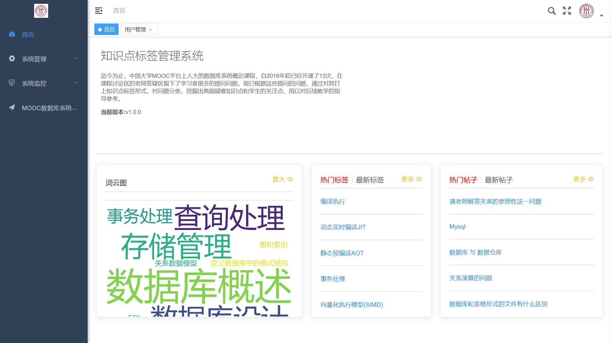
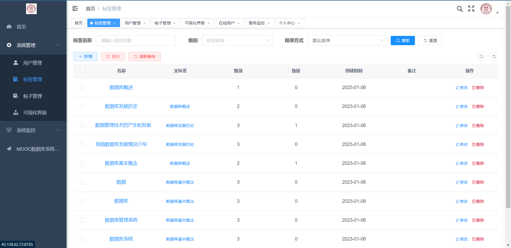
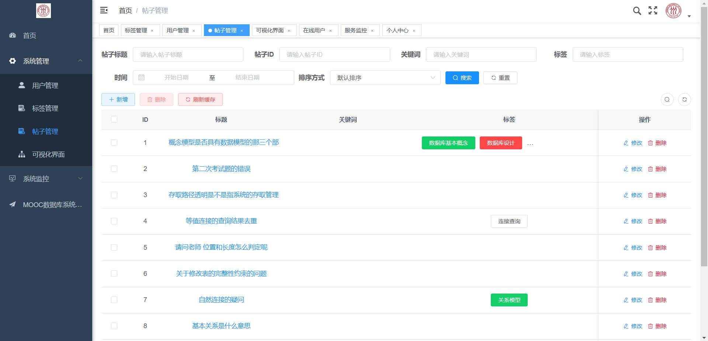

迄今为止，中国大学MOOC平台上人大的数据库系统概论课程，自2016年起已经开课了13次，在课程讨论区的老师答疑区留下了学习者很多的提问问题。现已根据这些提问的问题，通过对其打上知识点标签形式，对问题分类，挖掘出高频疑难知识点和学生的关注点，用以对后续教学的指导参考。知识点标签化管理信息系统是一个基于flask和vue框架开发的信息系统网站，主要面向MOOC平台上人大数据库系统概论课程师生，不仅提供提问帖子的标签管理，帖子库和标签库管理，帖子关键词、标签模糊搜索等基础服务，还能对已有数据深入挖掘，利用词云图等可视化方式，展现同学易错知识点，热门问题等信息，方便老师调整授课侧重点，同学把握课程疑难点。

## frontend

前端基于VUE框架开发，使用了[RuoYi-Vue: 🎉 基于SpringBoot，Spring Security，JWT，Vue & Element 的前后端分离权限管理系统，同时提供了 Vue3 的版本 (gitee.com)](https://gitee.com/y_project/RuoYi-Vue)模板。

使用了Vue、Element UI、AXIOS、Babel、Sass、Element-ui

## backend

后端基于Flask框架开发

## demo

[MOOC知识点标签管理系统](http://43.138.62.72:8765)

## show








## deploy

### 本机部署

创建容器并进入

```bash
docker run -itd -p <前端web服务器端口>:80 -p <后端服务器端口>:5000 --name <容器名称，如meta_info_docker> ubuntu
docker exec -it meta_info_docker bash
```

安装依赖

```bash
apt update && apt install -y unzip nginx  python3 python3-pip wget 
```

pip换源

```bash
mkdir -p ~/.pip && touch ~/.pip/pip.conf && echo -e "[global]\nindex-url = https://pypi.tuna.tsinghua.edu.cn/simple" > ~/.pip/pip.conf
```

安装web服务器

```bash
pip install waitress
```

新建项目目录

```bash
mkdir -p /root/frontend && mkdir -p /root/backend && mkdir -p /root/backend/log && cd /root/frontend
```

下载release，下载链接请以实际url为准

```bash
cd /root/frontend && wget  https://gitee.com/killuayz/meta_info_system/releases/download/v1.0.0/meta_info-1.0.0-frontend.tar.gz && tar zxvf *.tar.gz

cd /root/backend && wget https://gitee.com/killuayz/meta_info_system/releases/download/v1.0.0/meta_info-1.0.0-py3-none-any.whl
```

安装release

```bash
pip install *.whl
```

修改nginx配置

```bash
#/etc/nginx/sites-available/default添加以下配置
#其中的80端口可以根据需求更换，root /root/frontend要指向index.html所在的文件夹
server {        
    listen 80 default_server;       
    listen [::]:80 default_server;  
    server_name localhost;  
    root /root/frontend;    
    index index.html; 
    location / {try_files \$uri \$uri/ @router; } 
    location @router { rewrite ^.*$ /index.html last; }  
    location /prod-api {            
        proxy_pass http://localhost:5000;               
        proxy_redirect off;     
    } 
}

#/etc/nginx/nginx.conf 
user xxxx; 改为 user root;

#重启nginx
service nginx restart
```

#如果是第一次运行，还需要运行以下命令，初始化数据库，可能需要开启mysql数据库的local_infile,具体见MySQL ERROR 3948

```bash
flask init-db
```

启动服务

```bash
nohup waitress-serve --listen=127.0.0.1:5000  --call 'meta_info:create_app' > /root/backend/log/flask_run.log
```

省流版，新建ubuntu容器后，可以直接复制以下命令直接执行

```bash
xxxxxxxxxx docker run -itd -p <前端web服务器端口>:80 -p <后端服务器端口>:5000 --name <容器名称，如meta_info_docker> ubuntudocker exec -it meta_info_docker bash

#配置
echo "开始部署...\n" && echo "开始安装依赖...\n" && apt update && apt install -y unzip nginx  python3 python3-pip wget && mkdir -p ~/.pip && touch ~/.pip/pip.conf && echo -e "[global]\nindex-url = https://pypi.tuna.tsinghua.edu.cn/simple" > ~/.pip/pip.conf && cat ~/.pip/pip.conf  && pip install waitress && echo "依赖安装成功\n" && echo "正在从gitee上下载并安装软件release最新版本...\n" && mkdir -p /root/frontend && mkdir -p /root/backend && mkdir -p /root/backend/log && cd /root/frontend && wget  https://gitee.com/killuayz/meta_info_system/releases/download/v1.0.0/meta_info-1.0.0-frontend.tar.gz && tar zxvf *.tar.gz && chmod -R 777 /root/frontend && cd /root/backend && wget https://gitee.com/killuayz/meta_info_system/releases/download/v1.0.0/meta_info-1.0.0-py3-none-any.whl && pip install *.whl && echo "安装完成\n" && echo "正在进行部署配置..." && echo "server {        listen 80 default_server;       listen [::]:80 default_server;  server_name localhost;  root /root/frontend;    index index.html; location / {try_files \$uri \$uri/ @router; } location @router { rewrite ^.*$ /index.html last; }  location /prod-api {            proxy_pass http://localhost:5000;               proxy_redirect off;     } }"  > /etc/nginx/sites-available/default  && rm  /usr/share/nginx/html/index.html && sed -i '1d' /etc/nginx/nginx.conf && echo "user root;" >> /etc/nginx/nginx.conf && echo "正在启动服务..." && export FLASK_APP=meta_info && export SERVER_IP=43.138.62.72:8766 && export LC_ALL=en_US.UTF-8

#如果是第一次运行，还需要运行以下命令，初始化数据库，可能需要开启mysql数据库的local_infile,具体见MySQL ERROR 3948
flask init-db

#运行
nohup waitress-serve --listen=127.0.0.1:5000  --call 'meta_info:create_app' > /root/backend/log/flask_run.log &

```

### docker 部署 

还在调整，可能存在bug~

```bash
#1.下载Dockerfile
#2.编译dockerfile
docker build -t meta_info:v1 .

#3.运行docker
docker run -itd \
	--name meta_info -p xxxx:80 \  #将外部端口绑定到80上
	-e MYSQL_HOST= <mysql服务器地址，默认为127.0.0.1> \
	-e MYSQL_PORT= <mysql服务器端口，默认为3306> \
	-e MYSQL_USER= <mysql服务器用户，默认为root> \
	-e MYSQL_PASSWORD= <mysql服务器密码，默认为123456> \
	-e MYSQL_DATABASE= <mysql服务器数据库，默认为meta_info_db> \
	meta_info:v1

```

